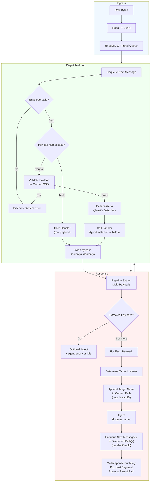
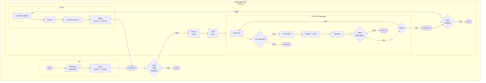

# Message Pump — End-to-End Flow (v2.0)

The AgentServer message pump processes individual messages through a single, linear, attack-resistant pipeline. The outer dispatcher runs a continuous async loop, draining per-thread message buffers (queues) until empty — enabling persistent, branched reasoning without artificial limits.

## Detailed Stages (Per-Message)

1. **Ingress/Enqueue**: Raw bytes → repair → preliminary tree → enqueue to target thread buffer.

2. **Dispatcher Loop**: Single async non-blocking loop selects next message from per-thread queues (breadth-first default for fairness).

3. **Processing**:
   - Full repair + C14N.
   - Envelope validation.
   - Routing decision:
     - **Meta Branch** (`https://xml-pipeline.org/ns/meta/v1` namespace): Handled directly by privileged core handler (no listener lookup or XSD validation needed).
       - Purpose: Introspection and reserved organism primitives.
       - Examples:
         - `request-schema`, `request-example`, `request-prompt`, `list-capabilities` (returns XSD bytes, example XML, prompt fragment, or capability list).
         - Thread primitives like `spawn-thread`, `clear-context`.
       - Privileged: Controlled via YAML `meta` flags (e.g., `allow_schema_requests: "admin"` or "none"). Remote queries optional.
       - Why separate: Faster, safer (no user listener involved), topology privacy preserved.
     - Capability namespace → normal listener route (XSD validation + deserialization).

   - Typed handler call → raw bytes.

4. **Response Handling**:
   - Dummy wrap → extract multi-payloads.
   - Each enqueued as new message(s) in appropriate thread buffer(s).

5. **Egress**: Dequeue → C14N/sign → send.

## Key Properties
- Continuous looping until all thread buffers empty — natural iteration/subthreading without one-shot constraints.
- Multi-payload enqueues enable parallel branches/thoughts.
- Scheduling balances deep dives vs fair exploration.
- Attack-resistant at every step.

XML in → queued → processed → multi-out → re-queued. Loops forever if needed. Safely. Permanently.